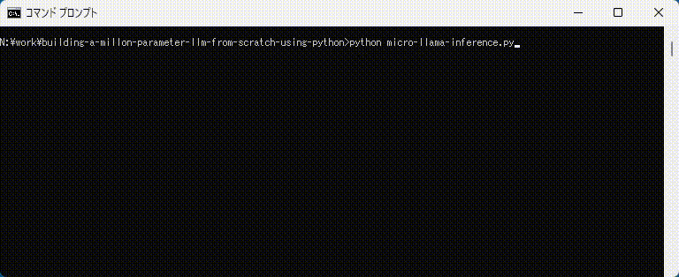

# Micro llama

Working Jupyter notebook from following tech blog article.

----

## Building a Million-Parameter LLM from Scratch Using Python
A Step-by-Step Guide to Replicating LLaMA Architecture

https://levelup.gitconnected.com/building-a-million-parameter-llm-from-scratch-using-python-f612398f06c2

----
## Description

The Llama model in this blog article is tiny and easy to read and understand.
The model uses a character-tokenization strategy, not sub-word-tokenization, to keep the model small enough for education.
Due to the limitations above, the model accuracy is not good. It generates English-like text. However, the accuracy of the model is not the goal of the model and blog article.

I appreciate the well-organized and detailed description of the original blog article.

